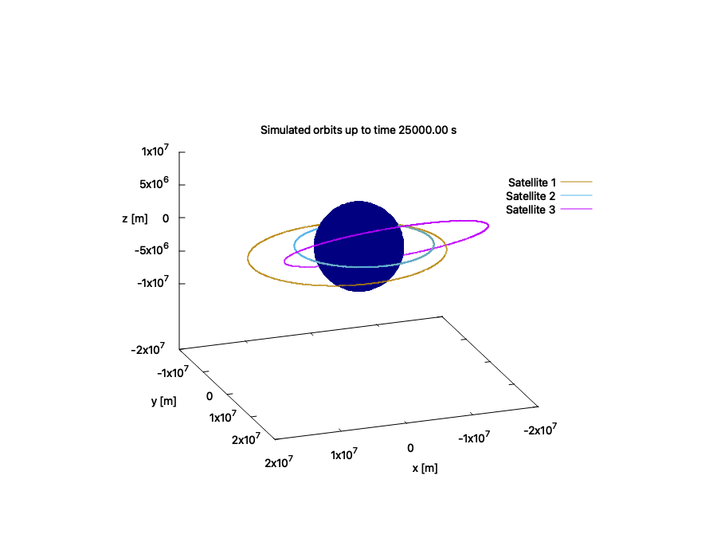

# SatSim: A C++ library for 6 DoF simulations of customizable satellites in Earth's orbit.

## Current Features:

- RK4(5) method for time evolution

- Simulation and plotting of multiple satellite objects
  
- Optionally includes calculation of accelerations due to J2 perturbation

- Support for adding LVLH frame thrust profiles to satellites

   - Currently supports constant-thrust profiles over a specified time period
 
- Support for adding body-frame torque profiles to satellites

   - Currently supports constant-torque profiles over a specified time period

- 3D visualization of simulated satellite orbits

   - Note: You can click and drag the resulting 3D plot to adjust camera angle as desired

- Plotting of orbital elements over time

- Plotting of spacecraft attitude values (e.g., Tait-Bryan angles and angular velocities of spacecraft body frame) over time
  
- Simple customizable phased array ground stations

- Automatically-generated thrust profiles for select orbital maneuvers:

   - Continuous (low) thrust orbit raising/lowering between circular orbits
   
   - Continuous (low) thrust maneuvers to change argument of perigee
      
      - Note: Thrust profiles of argument of periapsis change maneuvers are calculated assuming a "continuous" maneuver takes place (i.e., a burn arc angle $\alpha = \pi/2$ radians in https://apps.dtic.mil/sti/tr/pdf/ADA384536.pdf). Therefore it is not recommended to use this feature outside of parameter ranges where this assumption does not hold. Maneuvers that take place over a fraction of an orbit are not recommended.

## SatSim Build + Install Instructions
Note: this tool requires gnuplot to be installed.

1. From the project root directory: `./build.sh`
2. Navigate to the new build directory: `cd build`
3. To install the library: `cmake --install .` (you may need to run this line with sudo to grant appropriate permissions)

## Example Workflow for a Project Using SatSim

Note: see the "example_project" folder for source files of an example project.

1. Make an input json file for each satellite you'd like to simulate. All angles are entered as degrees. Currently, each satellite is defined by:
   -  Its 6 initial orbital parameters (semimajor axis, inclination, RAAN, argument of periapsis, eccentricity, and true anomaly)
       - Note: zero-inclination orbits are not currently supported.
   -  Satellite mass
   -  Satellite name
   -  (Optional) Initial Roll, Pitch, Yaw angles of satellite body relative to LVLH frame (note: A x-z'-y'' rotation sequence is currently baselined between the LVLH frame and the satellite body frame)
   -  (Optional) Initial angular velocities $\omega$ of satellite body frame around its x,y,z axes with respect to the LVLH frame, represented in the satellite body frame
   -  (Optional) Diagonal components of satellite inertia ($J$) matrix
   -  (Optional) Plotting color (the display color of its orbit) is an optional parameter, but must be one of the named colors ("colornames") in gnuplot. (see existing examples, e.g., input.json).
2. In the main .cpp file of your project, set up the simulations/visualizations that you're interested in. This can include, e.g.,: (see simulation_setup.cpp for an example .cpp file demonstrating various functionalities)
   - Creating Satellite objects for each simulated satellite from JSON input files
   - Setting simulation parameters
   - Adding desired thrust and/or torque profiles to satellites
   - Adding desired orbital maneuvers to satellites
   - Calling the simulation+plotting functions you're interested in
       - e.g., sim_and_draw_orbit_gnuplot for a 3D visualization of the orbit(s)
       - Make sure all satellites you want to simulate are contained in the vector passed into the simulation+plotting function call(s)
3. Configure the CMakeLists.txt of the project to use SatSim (once it's built and installed) and its dependencies (see the CMakeLists.txt in example_project for an example)
4. Create an empty build directory for the project: `mkdir build`
5. Navigate to the new build directory: `cd build`
6. Run `cmake ..`
7. Run `cmake --build .` to build the executable
8. Run `./run` to run the executable

## TO DO
- Automate code coverage badge updating via Github Actions
- Change thrust profiles to be input in the satellite body-frame
- Implement an energy-conserving solver

## Notes
Simulation of zero-inclination orbits isn't currently supported, as the magnitude of the line of nodes is currently used in the denominator of calculations updating orbital elements over the course of time evolution. The line of nodes has zero magnitude during zero-inclination orbits, causing NaNs in several calculations of orbital elements (specifically the RAAN, argument of periapsis, and argument of latitude). It's also not recommended to simulate orbits with eccentricities too close to 0, as eccentricity isn't exactly preserved (it's calculated numerically from orbital position and velocity), which can cause unexpected orbital behavior.

Calculation of instantaneous orbital angular acceleration does not currently include any contribution from the time derivative of the magnitude of the orbital angular momentum vector.

Loss of propellant mass during burns is not yet accounted for.

Visualization/plotting is done via Gnuplot. The copyright and permission notice of Gnuplot is shown below:

Copyright 1986 - 1993, 1998, 2004   Thomas Williams, Colin Kelley

Permission to use, copy, and distribute this software and its
documentation for any purpose with or without fee is hereby granted,
provided that the above copyright notice appear in all copies and
that both that copyright notice and this permission notice appear
in supporting documentation.

Permission to modify the software is granted, but not the right to
distribute the complete modified source code.  Modifications are to
be distributed as patches to the released version.  Permission to
distribute binaries produced by compiling modified sources is granted,
provided you
  1. distribute the corresponding source modifications from the
   released version in the form of a patch file along with the binaries,
  2. add special version identification to distinguish your version
   in addition to the base release version number,
  3. provide your name and address as the primary contact for the
   support of your modified version, and
  4. retain our contact information in regard to use of the base
   software.
Permission to distribute the released version of the source code along
with corresponding source modifications in the form of a patch file is
granted with same provisions 2 through 4 for binary distributions.

This software is provided "as is" without express or implied warranty
to the extent permitted by applicable law.
